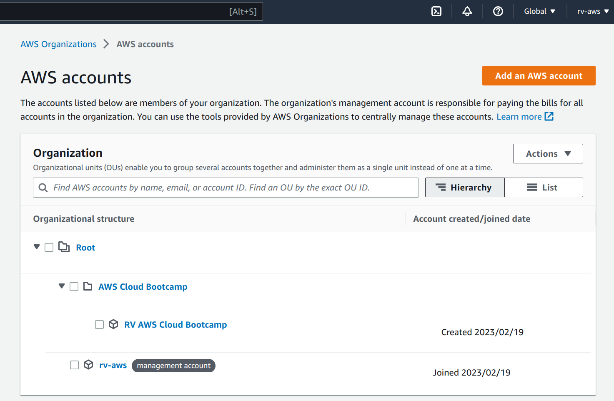

# Week 0 — Billing and Architecture

## Conceptual Diagram
* Watched the Week 0 live instruction video, followed along and created the [conceptual diagram](./week0/Cruddur%20-%20Conceptual%20Diagram.png) (identical to the one in the video) for Cruddur in Lucid. Added some services I'm familiar with that could be used. https://lucid.app/lucidchart/96e237a1-fe17-42cb-a8a4-951432b1a03b/edit?viewport_loc=-1507%2C-431%2C4967%2C2578%2C0_0&invitationId=inv_a2a9d9f5-8150-4155-bd89-36e4d1e1acf1

## AWS Billing/Spend Considerations
* Followed along with the Pricing Basics and Free tier video by Chirag Nayyar. I set up a [Cloudwatch billing alarm](./week0/AWS%20Billing%20Alert.png), made sure it was setup in the us-east-1 region, and confirmed the SNS subscription to my email. I set up the [monthly cost budget](./week0/AWS%20Billing%20Budget.png) as well.
* Learnt about utilising tags assigned to AWS resource to potentially categorise resource costs by a defined metric. I read more about the cost allocation tags feature in the AWS docs here — https://docs.aws.amazon.com/awsaccountbilling/latest/aboutv2/cost-alloc-tags.html

## AWS Security Considerations
* Created a separate organization as well as an AWS account for AWS Cloud Bootcamp work, so that my main/root account stays as is. This should make it easy to separate costs, as well as keep the bootcamp related resources separate. Weirdly I don't know why the join date for my root/management account is Feb 19th, the AWS account was created much earlier. Maybe it's cause I first utilised the organization feature, which led to the creation of the separate root organization? 
* Here is where I got a bit confused, and had a momentary thought to move the main management account to under the bootcamp org, before realising that's not the right thing to do. I ended up creating a new account, which was also confusing for a bit, cause I thought I wouldn't have to do so. The new account which I created, I did not expect it to be a root account, but turns out it is a root account for the new bootcamp specific organization! At this point I decided to leave it as is and continue watching Ashish's video.
* I created Cloudtrail events, following along with Ashish's segment on Cloudtrail. I remember reading from the Discord #announcements channel about how the data logging can rack up costs, and in the thread Ashish mentioned you don't need to have Cloudtrail logging if you don't need a permanent record, so I ended up deleting the events and the bucket as well. I did this in both my root management account as well as the bootcamp account. I forgot to take screenshots of created cloudtrails, but I remembered that just in time to take screenshots of the successful delete message for the related buckets. Does that count? 😂 Anyways, the root account S3 bucket had logs from all the regions, which piqued my curiosity, and I downloaded one of the log files. Somewhere in the above process I queried the AWS API (via the frontend) for a list of lambda functions. It was cool to see the level of logging being done, and this solidified the decision to not have any trails created. Screenshot of bucket deleted messages [here](./week0/aws-root-bucket-deletion.png) and [here](./week0/aws-bootcamp-bucket-deletion.png), and a screenshot of the downloaded log trail (PII redacted obviously) [here](./week0/aws-cloudtrail-log-file.png).
* After watching the IAM Users and Roles sections fully, I now completely understood the checklist item to create an Admin account. At my work I have a non-prod and prod AWS account, which are obviously IAM user accounts. But I don't manage it and my usage of it is only when the need arises (since we were a startup, and I'm employee #6, so I did a lot of varied random things apart from core application development).
* I created the IAM User and assigned the AdministratorAccess policy to said user. Set up MFA and access keys/credentials for development purposes and CLI usage. [IAM User Image here](./week0/aws-iam-user.png), [Admin Policy attached image here](./week0/aws-admin-policy-attached.png), and [access key + MFA image here](./week0/aws-credentials-generated.png).

## Misc Homework Stuff
* [AWS CLI was already installed](./week0/aws-cli-installed.png), since I use AWS at work. AWS MFA was already set up as well. Since I was using AWS MFA for work, I knew how to set it up for the root account. I was already aware of IAM roles, creating IAM roles with different permissions. I use https://github.com/broamski/aws-mfa, which comes in really handy in order to work with different profiles (personal, work non-prod, work prod, etc.) and have their temporary tokens easily refreshed.
* Opened cloudshell, played around with the shell. Seeing `.zshrc` in the home folder made me wonder, and turns out, you can use `oh-my-zsh`! I couldn't believe it. Naturally, I spent a small amount of time setting up the shell the way I want it. Well, not exactly, since it didn't look like I could install a custom font, but I can't believe my cloudshell can be feature filled! This is awesome. Screenshots [here](./week0/cloudshell-1.png) and [here](./week0/cloudshell-2.png).
* Worked on creating the logical diagram. Couldn't think of much that deviates from what's shown in the video. I added API Gateway with Authorizer as a lambda function integrated with API Gateway since that's the setup at work. Hopefully after having worked directly on and with AWS services in the course of this bootcamp, I'll be able to come up with my own and possibly a unique logical diagram! [Linked image of diagram](./week0/Cruddur-LogicalDiagram.png), and the link to diagram in Lucid charts — https://lucid.app/lucidchart/2f58329f-59c0-4ef2-9392-e0b2a77c2b71/edit?viewport_loc=-491%2C-64%2C3072%2C1595%2C0_0&invitationId=inv_09afb62a-0deb-443f-a9b8-202c73b8e8cf